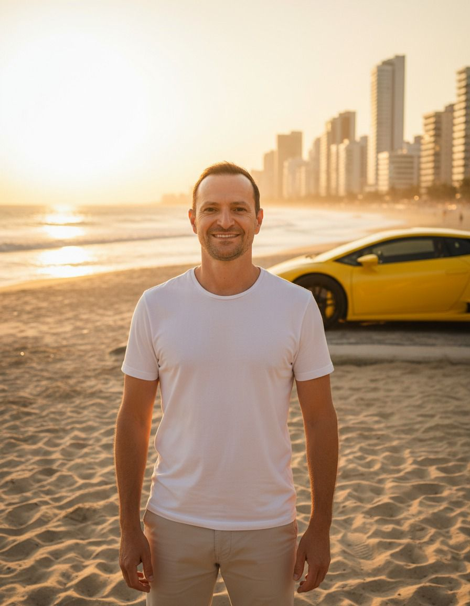

<html lang="pt-BR">
<head>
  <meta charset="utf-8" />
  <meta name="viewport" content="width=device-width, initial-scale=1" />
  <meta name="color-scheme" content="light only">
  <meta name="theme-color" content="#ffffff">

  <title>Relacionamentos Conscientes | Workshop (19 e 20/02/2026 às 20h)</title>
  <meta name="description" content="Workshop de duas noites: Relacionamentos Conscientes — Do vínculo inconsciente ao encontro real. 19 e 20 de fevereiro de 2026 às 20h." />

  <!-- Canonical -->
  <link rel="canonical" href="https://seu-dominio.com/relacionamentos-conscientes" />

  <!-- OG/Twitter -->
  <meta property="og:title" content="Relacionamentos Conscientes | Workshop" />
  <meta property="og:description" content="Do vínculo inconsciente ao encontro real. Relacionamento não é sobre encontrar alguém. É sobre o lugar interno a partir do qual eu me relaciono." />
  <meta property="og:type" content="website" />
  <meta property="og:locale" content="pt_BR" />
  <meta property="og:image" content="https://via.placeholder.com/1200x630.png?text=Relacionamentos+Conscientes" />
  <meta property="og:url" content="https://seu-dominio.com/relacionamentos-conscientes" />
  <meta name="twitter:card" content="summary_large_image" />
  <meta name="twitter:title" content="Relacionamentos Conscientes | Workshop" />
  <meta name="twitter:description" content="Do vínculo inconsciente ao encontro real. 19 e 20/02/2026 às 20h." />
  <meta name="twitter:image" content="https://via.placeholder.com/1200x630.png?text=Relacionamentos+Conscientes" />

  <link rel="icon" href="https://via.placeholder.com/64.png" />
  <link rel="preconnect" href="https://fonts.googleapis.com" />
  <link rel="preconnect" href="https://fonts.gstatic.com" crossorigin />
  <link href="https://fonts.googleapis.com/css2?family=Manrope:wght@400;600;700;800;900&family=Fraunces:opsz,wght@9..144,600;9..144,700&display=swap" rel="stylesheet" />
/* ===== OVERRIDE: Títulos menores ===== */
.hero-title{
  /* antes: clamp(28px, 6.2vw, 58px) */
  font-size: clamp(26px, 5.0vw, 44px);
  line-height: 1.04;
  letter-spacing: -0.4px;
}

.card-title{
  /* antes: clamp(26px, 5.6vw, 44px) */
  font-size: clamp(24px, 4.6vw, 36px);
  line-height: 1.06;
  letter-spacing: -0.35px;
}

/* Mobile (iPhone) */
@media (max-width: 430px){
  .hero-title{
    /* antes: clamp(22px, 8.2vw, 34px) */
    font-size: clamp(20px, 7.0vw, 28px);
    letter-spacing: -0.3px;
  }
  .card-title{
    /* antes: clamp(20px, 7.2vw, 30px) */
    font-size: clamp(18px, 6.4vw, 24px);
    letter-spacing: -0.25px;
  }
}

  
</head>
<body>
  <a class="skip-link" href="#conteudo">Pular para o conteúdo</a>

  <!-- TOPBAR -->
  

    

      

        <a class="brand" href="#topo" aria-label="Ir ao topo">
          
          

            <strong>Relacionamentos Conscientes</strong>
            Do vínculo inconsciente ao encontro real
          

        </a>

        <nav aria-label="Navegação">
          <a href="#paraquem">É pra mim?</a>
          <a href="#conteudo">Conteúdo</a>
          <a href="#quem">Quem conduz</a>
          <a href="#pix">PIX</a>
          <a href="#faq">Dúvidas</a>
        </nav>
      

    

  

  <!-- HERO -->
  <header class="hero" id="topo">
    

      

        <!-- Card principal com “pull-up” no mobile -->
        

          

          
Workshop — 2 noites • 19 e 20 de fevereiro de 2026 • 20h

          <h1 class="hero-title">
            RELACIONAMENTOS
            CONSCIENTES
          </h1>

          
<b style="color:rgba(124,58,237,0.95);">Do vínculo inconsciente ao encontro real</b>

          

            

              Relacionamento não é sobre encontrar alguém. 
              É sobre o <b>lugar interno</b> a partir do qual eu me relaciono.
            

          

          <ul class="bullets" aria-label="O que você vai encontrar">
            <li><b>Clareza emocional</b> para entender o padrão (sem se culpar).</li>
            <li><b>Reposicionamento adulto</b> para parar de implorar e começar a escolher.</li>
            <li><b>Próximos passos</b> simples e práticos para aplicar no dia a dia.</li>
          </ul>

          

            Você muda a pessoa, mas a história se repete? Talvez não seja falta de amor. Talvez seja falta de lugar.
          

          

            <a class="btn primary" href="#pix">Pagamento via PIX</a>
            <a class="btn ghost" href="#paraquem">É pra mim?</a>
          

          

            Acolhimento • Consciência • Reposicionamento
            Sem exposição • Sem receita pronta
          

        

        <aside class="card side" aria-label="Informações do evento">
          
Informações do evento

          

📅 Datas

<b style="color:rgba(124,58,237,0.95);">19 e 20/02/2026</b>

          

⏰ Horário

<b style="color:rgba(124,58,237,0.95);">20h</b>

          

⏳ Duração

<b style="color:rgba(124,58,237,0.95);">2h por noite</b>

          

📍 Formato

<b style="color:rgba(124,58,237,0.95);">Online</b>

          

            

              <strong>Vagas limitadas</strong> 
              <s>De R$ 260,00</s> <b style="color:rgba(124,58,237,0.95);font-size:18px;">Por R$ 44,00</b>
            

            ⭐
          

          

            Um workshop de duas noites para quem cansou de repetir padrões, se perder de si e deseja se relacionar a partir de um lugar mais consciente, adulto e verdadeiro.
          

          <a class="btn ghost" href="https://wa.me/5549998110445?text=Ol%C3%A1!%20Quero%20tirar%20uma%20d%C3%BAvida%20sobre%20o%20Workshop%20Relacionamentos%20Conscientes." target="_blank" rel="noopener">Tirar dúvida no WhatsApp</a>
        </aside>

      

    

  </header>

  <main id="conteudo">
    <!-- PARA QUEM -->
    <section>
      

        

          <h2 class="section-title">Se você se reconhece aqui, é para você</h2>
          
Você ama, tenta, conversa, se adapta… e mesmo assim algo sempre dói? Talvez não seja falta de amor. Talvez seja <b>o lugar emocional</b> de onde você se relaciona.

          

            

              <h3>✅ Este workshop é para você se…</h3>
              <ul class="check">
                <li>sente que repete padrões mesmo mudando de pessoa</li>
                <li>se perde de si tentando dar certo com alguém</li>
                <li>vive gatilhos, reatividade ou silêncios que afastam</li>
                <li>quer clareza emocional para se posicionar melhor</li>
                <li>está pronto(a) para se olhar com honestidade</li>
              </ul>
            

            

              <h3>❌ Não é para você se…</h3>
              <ul class="check">
                <li>procura receita pronta ou “frase mágica”</li>
                <li>quer mudar o outro sem mudar a si</li>
                <li>espera uma promessa de “salvar” relacionamento</li>
                <li>não está disposto(a) a assumir responsabilidade emocional</li>
                <li>quer apenas confirmar que “o outro é o problema”</li>
              </ul>
            

          

          

            

+ clareza

entender o padrão sem autoengano

            

+ presença

sair do automático e voltar para si

            

+ direção

ajustar, sustentar ou encerrar com respeito

          

        

      

    </section>

    <!-- O QUE É + VIRADA -->
    <section>
      

        

          

            <h2 class="section-title">O que é o Workshop Relacionamentos Conscientes?</h2>
            
Um workshop de duas noites para reorganizar o seu lugar interno — e, a partir disso, transformar a forma como você se relaciona.

            <ul class="check"><li>Não é terapia em grupo.</li><li>Não é exposição de histórias.</li><li>Não é um curso “racional” de comunicação.</li></ul>
            
É um espaço de <b>consciência</b>, <b>acolhimento</b> e <b>reposicionamento interno</b>: para sair do vínculo inconsciente (padrão) e caminhar para o encontro real (presença).

          

          

            <h2 class="section-title">A virada central</h2>
            
A maioria das pessoas entra em relacionamentos a partir de lugares inconscientes: carência, medo de abandono, necessidade de aprovação ou tentativa de preencher vazios emocionais.

            

<b>Adulto não ama implorando.</b> Adulto ama escolhendo.

            
Quando o lugar interno muda, a relação responde.

          

        

      

    </section>

    <!-- DUAS NOITES -->
    <section>
      

        

          <h2 class="section-title">O que será trabalhado em cada noite</h2>
          
A estrutura foi desenhada para levar você de uma clareza profunda (noite 1) para um reposicionamento prático (noite 2).

          

            

              <h3>🌙 Noite 1 — O vínculo inconsciente</h3>
              
<b>Objetivo:</b> entender por que dói e por que se repete.

              <ul class="check"><li>Padrões repetitivos nos relacionamentos</li><li>De onde vem o seu jeito de amar</li><li>Carência, expectativa e projeção</li><li>O outro como espelho emocional</li><li>Como você se perde de si</li></ul>
            

            

              <h3>🌙 Noite 2 — O encontro real</h3>
              
<b>Objetivo:</b> saber o que fazer a partir de agora.

              <ul class="check"><li>O lugar adulto no relacionamento</li><li>Comunicação consciente (sem ataque e sem defesa)</li><li>Limites e responsabilidade emocional</li><li>Clareza: sustentar, ajustar ou encerrar</li><li>Próximo passo consciente (plano simples)</li></ul>
            

          

        

      

    </section>

    <!-- QUEM CONDUZ -->
    <section id="quem">
      

        

          <h2 class="section-title">Quem conduz</h2>

          

            

              
<b>Evandro Favoretto</b> Mentor em desenvolvimento emocional e relacional.

              
Um trabalho voltado para reposicionamento interno e clareza emocional: organizar o lugar de onde você se relaciona para viver relações mais conscientes, leves e verdadeiras.

              

<b>Não é falta de amor.</b> Muitas vezes, é falta de lugar.

            

            

              
            

          

        

      

    </section>

    <!-- CARD secundário -->
    <section>
      

        

          
Workshop — 2 noites • 19 e 20/02/2026 • 20h

          <h2 class="card-title" aria-label="Título do workshop">
            RELACIONAMENTOS
            CONSCIENTES
          </h2>
          
<b style="color:rgba(124,58,237,0.95);">Do vínculo inconsciente ao encontro real</b>

          

Relacionamento não é sobre encontrar alguém. É sobre o <b>lugar interno</b> a partir do qual eu me relaciono.

        

      

    </section>

    <!-- PIX -->
    <section id="pix">
      

        

          <h2 class="section-title">Pagamento via PIX</h2>
          
Faça o PIX e envie o comprovante no WhatsApp para confirmar sua vaga.

          

            

              
<small>Chave PIX (CNPJ)</small> <code id="pixKey">48674960000163</code>

              <button class="copybtn" type="button" id="copyPix">Copiar chave</button>
            

            
<small>Favorecido</small> <b>EA Favoretto LTDA</b>

            
Chave PIX copiada ✅

            

              <a class="btn primary" href="https://wa.me/5549998110445?text=Ol%C3%A1!%20Fiz%20o%20PIX%20do%20Workshop%20Relacionamentos%20Conscientes%20(CNPJ%2048674960000163%20-%20EA%20Favoretto%20LTDA)%20e%20vou%20enviar%20o%20comprovante.%20Pode%20confirmar%20minha%20vaga%3F" target="_blank" rel="noopener">Enviar comprovante no WhatsApp</a>
              <a class="btn ghost" href="https://wa.me/5549998110445?text=Ol%C3%A1!%20Tenho%20uma%20d%C3%BAvida%20sobre%20o%20Workshop%20Relacionamentos%20Conscientes." target="_blank" rel="noopener">Tirar dúvida no WhatsApp</a>
            

            
Dica: ao enviar o comprovante, informe seu <b>nome completo</b>.

          

        

      

    </section>

    <!-- Depoimentos -->
    <section id="depoimentos">
      

        

          <h2 class="section-title">O que as pessoas costumam sentir depois</h2>
          
Substitua por depoimentos reais quando quiser.

          

            

“Eu parei de tentar convencer e comecei a me posicionar. Foi leve e direto.”

Mariana S.

            

“Saí com clareza do que é meu e do que é do outro. Isso muda tudo.”

Ricardo P.

            

“Percebi onde eu estava me anulando e consegui colocar limites sem brigar.”

Camila R.

            

“Foi como organizar a mente e o coração. Hoje eu escolho com mais maturidade.”

Fernando L.

          

          

            <a class="btn ghost" href="#pix">Voltar ao PIX</a>
            <a class="btn ghost" href="https://wa.me/5549998110445" target="_blank" rel="noopener">Falar no WhatsApp</a>
          

        

      

    </section>

    <!-- FAQ -->
    <section class="faq" id="faq">
      

        

          <h2 class="section-title">Dúvidas comuns</h2>
          
Respostas simples para tirar dúvidas sem travar sua decisão.

          

Como confirmo minha vaga?

Faça o PIX para o CNPJ <b>48674960000163</b> (EA Favoretto LTDA) e envie o comprovante no WhatsApp.

          

Preciso estar em um relacionamento para participar?

Não. Esse workshop é sobre o seu lugar interno. Serve para quem está em relacionamento, para quem terminou, para quem está começando ou para quem quer se preparar melhor.

          

Isso é terapia em grupo?

Não. É um workshop de consciência e reposicionamento interno. Você participa com presença, exercícios e reflexões, sem necessidade de exposição pessoal.

          

Vai ter exercícios?

Sim. Exercícios guiados (simples e profundos) para trazer clareza emocional e próximos passos.

        

      

    </section>
  </main>

  <!-- WhatsApp floating -->
  <a class="whats-float" href="https://wa.me/5549998110445?text=Ol%C3%A1!%20Quero%20tirar%20uma%20d%C3%BAvida%20sobre%20o%20Workshop%20Relacionamentos%20Conscientes." target="_blank" rel="noopener" aria-label="Falar no WhatsApp">
    <svg viewBox="0 0 24 24" aria-hidden="true"><path d="M20.5 3.5A10 10 0 0 0 3.2 17.7L2 22l4.4-1.2A10 10 0 1 0 20.5 3.5Zm-8.4 2.2c4.1 0 7.4 3.3 7.4 7.4a7.4 7.4 0 0 1-10.1 6.8l-.3-.1-2.6.7.7-2.5-.1-.3a7.4 7.4 0 0 1 5-11.9Zm4.2 9.8c-.2.6-1.1 1-1.5 1.1-.4.1-.9.1-1.5 0s-1.5-.5-2.6-1.1c-1-.6-1.8-1.6-2.1-2.1-.3-.5-.5-1.3-.1-1.9.2-.3.5-.8.8-.8h.6c.1 0 .4-.1.6.5.2.6.8 2 .9 2.2.1.2.1.4 0 .6s-.2.4-.4.6c-.2.2-.4.4-.2.7.2.3.9 1.4 2.1 2 .9.5 1.6.6 1.9.4.3-.2.4-.5.6-.8.2-.3.5-.4.8-.3l1.9.9c.3.1.5.3.6.5Z"/></svg>
  </a>

  <!-- FOOTER -->
  <footer>
    

      

        

          
Relacionamentos Conscientes

          
Do vínculo inconsciente ao encontro real

          
Contato: <a href="https://wa.me/5549998110445" target="_blank" rel="noopener">(49) 99811-0445</a>

        

        

          
©  • Todos os direitos reservados EA Favoretto LTDA

          
<a href="#topo">Voltar ao topo</a>

        

      

    

  </footer>

  
</body>
</html>
